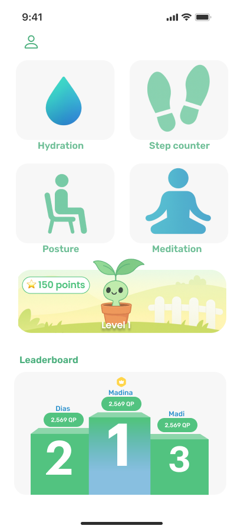
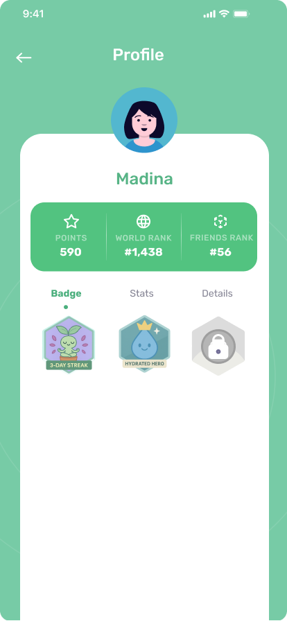
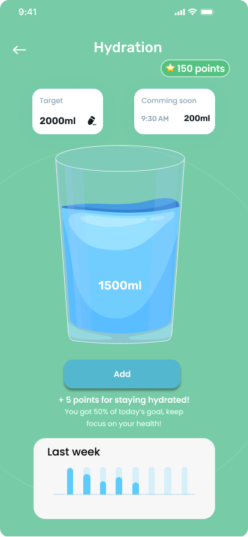
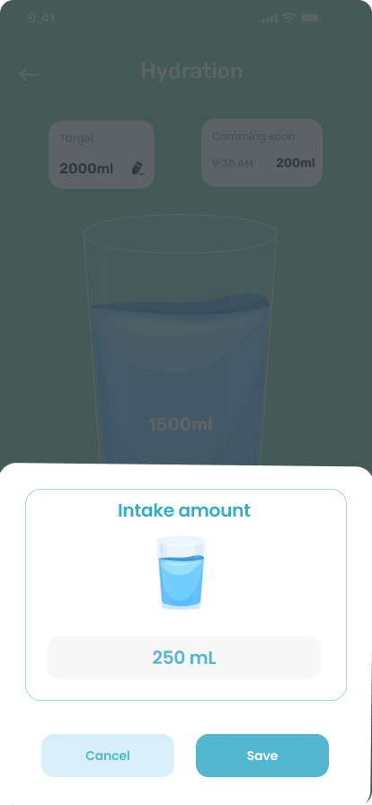
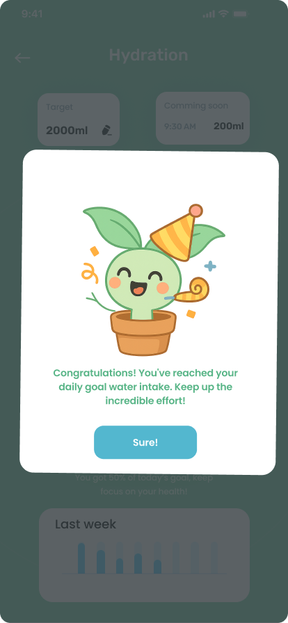
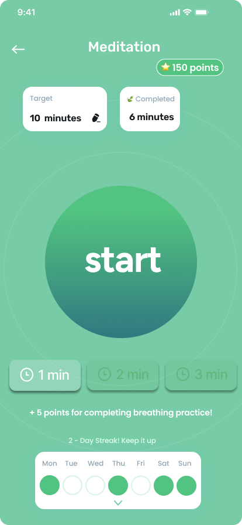
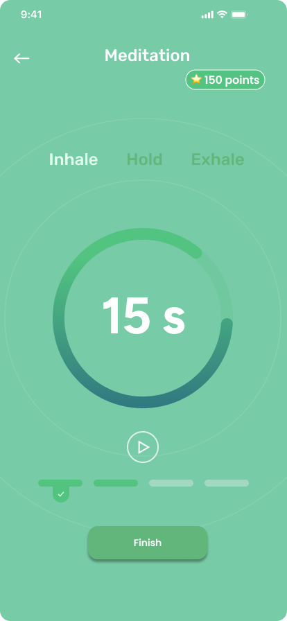
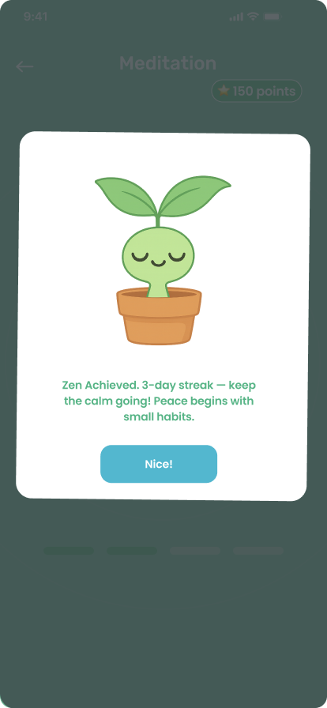
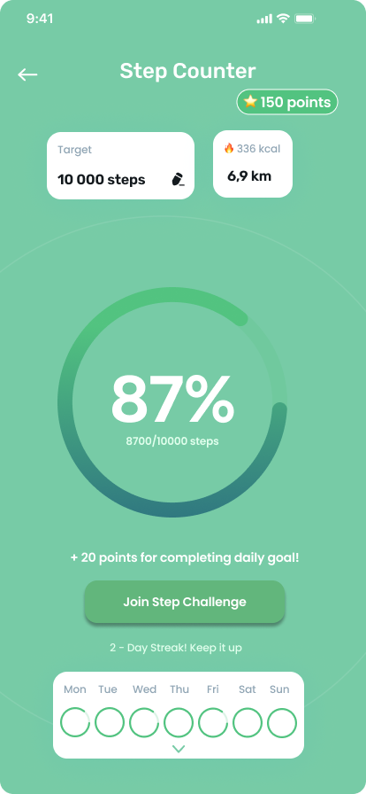

# Smart Health Reminder

A Flutter-powered health companion that tracks steps, reminds hydration based on weather, and suggests mindfulness breaks. Built with a scalable architecture using Provider, Firebase, and platform-native integrations.

---

## 🚀 Features

- **Step Tracking**  
  Real-time step count using device sensors via the `pedometer` package.

- **Hydration Reminders**  
  Smart notifications based on current weather conditions using OpenWeatherMap API.

- **Firebase Authentication**  
  Secure user sign-up and login.

- **User Preferences**  
  Saved locally with `shared_preferences` or synced to Firestore for cloud backup.

- **Smart Notifications**  
  - Background push: `firebase_messaging`  
  - Local scheduled alerts: `flutter_local_notifications`

- **Mindfulness Nudges**  
  Suggests breaks based on screen-on time using native method channels.

## 🔧 Setup Instructions

1. **Clone the repo**
   ```bash
   git clone https://github.com/AmankeldinovaMadina/smart_health_reminder.git
   cd smart_health_reminder
   flutter pub get 

## 📸 App Preview
- **Implemented:**
  Welcome page, registration and login page
<p align="center">
  
  
  
</p>

- **Coming soon:**
  Main page, leaderboard, user profile
<p align="center">
  
  
  
  
</p>
Hydration pages:
<p align="center">
  
  
  
</p>
Meditation pages:
<p align="center">
  
  
  
</p>
Step Counter page:
<p align="center">
  
</p>
Plant Gamification pages:
<p align="center">
  
</p>
<p align="center">
  
  
  
  
</p>


